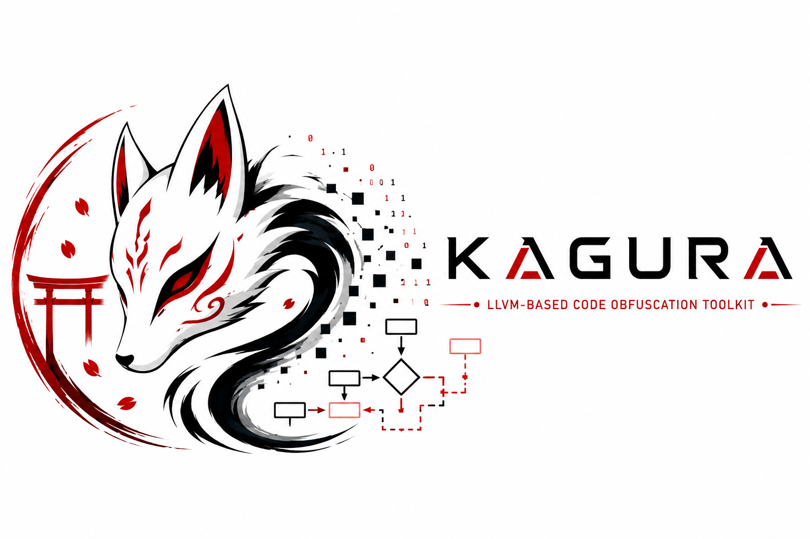

<p align="center">
  
</p>

<p align="center">
  <a href="https://github.com/ykus4/kagura/actions/workflows/ci.yml">
    
  </a>
  <a href="https://github.com/ykus4/kagura/actions/workflows/release.yml">
    
  </a>
  
  
  
  
  <a href="https://github.com/ykus4/kagura/discussions">
    
  </a>
  <a href="https://doi.org/10.5281/zenodo.20361447">
    
  </a>
</p>

# Kagura

> **LLVM-based code obfuscation and anti-tamper toolkit for mobile, desktop, and WebAssembly targets.**

Built on the **New Pass Manager** (LLVM 17+). Loaded as a pass plugin via `-fpass-plugin` — no LLVM source tree modification required.

**Supported platforms:** iOS · Android · macOS · Windows (MSVC/Clang-CL) · Linux · WebAssembly

## What it protects against

| Threat | Countermeasure |
|:-------|:---------------|
| Static string extraction (`strings`, IDA imports) | XOR / AES string encryption (`kagura-str`, `kagura-str-aes`) |
| Decompiler-readable control flow | CFG flattening + bogus control flow (`kagura-fla`, `kagura-bcf`) |
| Memory editor / GameGuardian value freeze | Per-store/load XOR (`kagura-mvo`, `kagura-pe`) + `Protected<T>` runtime |
| Frida / Substrate dynamic instrumentation | Runtime hook & breakpoint detection (`kagura-anti-debug`) |
| Binary patching (NOP-ing checks) | Per-BB opcode checksums (`kagura-bbcheck`) |
| Import table analysis | External calls via runtime-resolved thunks (`kagura-ci`) |
| Jailbreak / root detection bypass | Mach-O / ELF integrity, Magisk / Zygisk / LSPosed detection |

## Documentation

📚 **Full documentation: [ykus4.github.io/kagura](https://ykus4.github.io/kagura)**

| Topic | Link |
|:------|:-----|
| Install & first build | [Quick Start](https://ykus4.github.io/kagura/getting-started/quick-start/) |
| Every pass (flags, effects, overhead) | [Passes](https://ykus4.github.io/kagura/passes/) |
| JSON policy DSL & strength profiles | [Configuration](https://ykus4.github.io/kagura/configuration/) |
| Xcode / Gradle / Unity / Unreal / Bazel / CMake / CocoaPods / SPM | [Integration](https://ykus4.github.io/kagura/integration/) |
| `Protected<T>` for HP / currency / etc. | [Game Protection](https://ykus4.github.io/kagura/game-protection/) |
| Differential, reproducible, angr / Ghidra / Frida | [Testing & Evaluation](https://ykus4.github.io/kagura/testing/) |

## Quick taste

```bash
clang -fpass-plugin=KaguraObfuscator.dylib \
      -mllvm -kagura-config=kagura.json \
      -O1 your_file.c -o your_file
```

```json
{ "profile": "BALANCED",
  "passes": { "str": true, "fla": true, "bcf": true, "mvo": true },
  "tuning": { "bcf_prob": 40, "seed": 12345 } }
```

## Citation

If you use Kagura in your research or build on it, please cite the [paper](https://zenodo.org/records/20361447):

```bibtex
@software{kagura,
  author    = {yotti},
  title     = {Kagura: LLVM-based Code Obfuscation and Anti-Tamper Toolkit},
  year      = {2025},
  publisher = {Zenodo},
  doi       = {10.5281/zenodo.20361447},
  url       = {https://doi.org/10.5281/zenodo.20361447}
}
```

## Community

- 💬 **[Discussions](https://github.com/ykus4/kagura/discussions)** — questions, ideas, share your use case
- 🐞 **[Issues](https://github.com/ykus4/kagura/issues)** — bugs and feature requests (templates provided)
- 📚 **[Documentation](https://ykus4.github.io/kagura)** — passes, configuration, integration, testing

## License

MIT — see [LICENSE](LICENSE).
