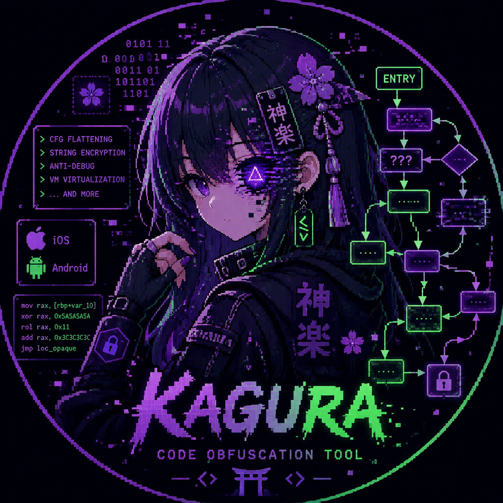

<p align="center">
  
</p>

<p align="center">
  
  
  
  
</p>

# Kagura

> LLVM-based code obfuscation and anti-tamper toolkit for iOS and Android native binaries.

Built on the **New Pass Manager** (LLVM 17+). Loaded as a pass plugin via `-fpass-plugin` — no LLVM source tree modification required.

---

## Architecture

```
kagura/
├── include/kagura/         # Public headers (Passes.h, Options.h, Utils.h, game_protect.h)
├── lib/Transforms/
│   ├── CFG/                # Control-flow obfuscation passes
│   ├── Data/               # String/constant/global/wide-string/memory-value encryption
│   ├── AntiAnalysis/       # Anti-debug, integrity, call indirection, honey values
│   ├── Platform/           # iOS (ObjC), Android (JNI), VM virtualization
│   ├── Infrastructure/     # DWARF control, config DSL, symbol map
│   ├── Options.cpp         # Centralized CLI flag definitions
│   ├── Plugin.cpp          # Pass registration & pipeline wiring
│   └── Utils.cpp           # Shared IR helpers & PRNG
├── runtime/                # C runtime library (linked into target binary)
├── integration/            # Xcode, Gradle, Unity, Unreal, CMake toolchains
├── scripts/                # verify-reproducible.sh, differential-test.sh, review-risk-assessment.sh
└── tests/                  # CTest + FileCheck lit-based regression tests
```

---

## Passes

### Control Flow (`CFG/`)

| Flag | Pass | Effect |
|:-----|:-----|:-------|
| `-kagura-fla` | ControlFlowFlattening | Converts CFG into a switch-based state machine |
| `-kagura-bcf` | BogusControlFlow | Injects dead blocks guarded by MBA opaque predicates |
| `-kagura-ibr` | IndirectBranch | Replaces direct calls with loads from function pointer globals |
| `-kagura-ci` | CallIndirection | Routes external calls through a runtime-resolved thunk table |
| `-kagura-lt` | LoopTransform | Adds bogus dead counters and opaque invariant branches |
| `-kagura-fsplit` | FunctionSplit | Extracts interior basic blocks into outlined helper functions |
| `-kagura-bbs` | BasicBlockSplitting | Splits large BBs at random points to inflate CFG complexity |
| `-kagura-bbr` | BasicBlockReordering | Shuffles BB layout to confuse linear disassemblers |
| `-kagura-dci` | DeadCodeInsertion | Inserts unreachable junk blocks to mislead static analysis |

### Data Obfuscation (`Data/`)

| Flag | Pass | Effect |
|:-----|:-----|:-------|
| `-kagura-str` | StringEncryption | XOR-encrypts narrow string literals; lazy decrypt on first access |
| `-kagura-str-aes` | StringEncryptionAES | AES-128-CTR string encryption (requires runtime) |
| `-kagura-wstr` | WideStringEncryption | XOR-encrypts wide strings (wchar_t / char16_t / char32_t) and CFString buffers |
| `-kagura-co` | ConstantObfuscation | Replaces integer constants with MBA expressions |
| `-kagura-sub` | Substitution | Replaces arithmetic/bitwise ops with equivalent MBA |
| `-kagura-genc` | GlobalEncryption | Encrypts private integer globals; inline XOR at load sites |
| `-kagura-mvo` | MemoryValueObfuscation | XOR-encrypts alloca'd integer locals at every store/load site |

### Anti-Analysis (`AntiAnalysis/`)

| Flag | Pass | Effect |
|:-----|:-----|:-------|
| `-kagura-anti-debug` | AntiDebug | ptrace, Frida port, `/proc/maps`, hook, breakpoint, emulator checks |
| `-kagura-tamper` | AntiTamper | FNV-1a function checksums + jailbreak/root detection at startup |
| `-kagura-pac` | PointerAuth | Software CFI via XOR-tagged function pointer globals |
| `-kagura-sv` | SymbolVisibility | Sets non-public symbols to hidden; strips from dynamic symtab |
| `-kagura-honey` | HoneyValue | Injects decoy secret globals and fake security-stub functions |

### Platform-Specific (`Platform/`)

| Flag | Pass | Target |
|:-----|:-----|:-------|
| `-kagura-objc` | ObjCObfuscation | iOS — obfuscates ObjC selector and class names in IR metadata |
| `-kagura-jni` | JNIObfuscation | Android — converts static `Java_*` to dynamic `RegisterNatives` |
| `-kagura-vm` | VMObfuscation | Virtualizes function bodies into a custom stack-based VM bytecode |

### Infrastructure (`Infrastructure/`)

| Flag | Pass | Effect |
|:-----|:-----|:-------|
| `-kagura-dwarf=strip\|obfuscate` | DWARFControl | Strip or remap DWARF debug info after obfuscation |
| `-kagura-config=<file>` | ConfigLoader | Load JSON policy file; apply profile preset and per-pass overrides |
| `-kagura-symmap` | SymbolMap | Emit JSON symbol map (original → obfuscated name) for crash symbolication |

### Utilities

| Flag | Pass | Effect |
|:-----|:-----|:-------|
| `-kagura-metrics` | ObfuscationMetrics | Prints BB/instruction/cyclomatic complexity delta |

---

## Tuning Parameters

| Option | Default | Description |
|:-------|:--------|:------------|
| `-kagura-seed=<N>` | `0` (entropy) | PRNG seed for reproducible output |
| `-kagura-bcf-prob=<N>` | `30` | Bogus CF probability per BB [0-100] |
| `-kagura-bcf-iter=<N>` | `1` | Bogus CF iterations |
| `-kagura-sub-iter=<N>` | `1` | Substitution iterations |
| `-kagura-dci-prob=<N>` | `40` | Dead code insertion probability [0-100] |
| `-kagura-bbs-min=<N>` | `3` | Min instructions before a BB split point |
| `-kagura-bbs-max-splits=<N>` | `2` | Max splits per basic block |
| `-kagura-sv-keep=<sym>` | — | Comma-separated symbols to keep visible |

### Phase 4.1 Infrastructure Options

| Option | Default | Description |
|:-------|:--------|:------------|
| `-kagura-lto-safe` | `false` | Enable passes during LTO/ThinLTO pipeline phases |
| `-kagura-o0-protect` | `false` | Enable lightweight protection (STR, AntiDebug) at `-O0` |
| `-kagura-dwarf=<mode>` | `keep` | DWARF handling: `keep` / `strip` / `obfuscate` |

### Phase 4.6 Build System Options

| Option | Default | Description |
|:-------|:--------|:------------|
| `-kagura-config=<path>` | — | Path to JSON policy file |
| `-kagura-symmap` | `false` | Emit symbol map after obfuscation |
| `-kagura-symmap-out=<path>` | `kagura_symmap.json` | Output file for symbol map |

---

## Config DSL & Strength Profiles

Kagura supports a JSON policy file (`-kagura-config=<path>`) to control all pass settings in one place.

```json
{
  "profile": "BALANCED",
  "passes": {
    "str":   true,
    "fla":   true,
    "bcf":   true,
    "honey": true,
    "mvo":   false
  },
  "tuning": {
    "bcf_prob": 40,
    "seed":     12345
  }
}
```

**Built-in profiles:**

| Profile | Passes | Intended use |
|:--------|:-------|:-------------|
| `FAST` | STR only | Debug/CI builds with minimal overhead |
| `BALANCED` | STR + BCF + BBR + BBS + GENC + MVO | Standard Release builds |
| `STRONG` | All passes, BCF prob 60, 2 iterations | Security-critical shipping builds |

---

## Game Protection

`include/kagura/game_protect.h` provides a C++17 header-only `Protected<T>` template for protecting game-critical values (HP, damage, currency, etc.) from memory scanners and freeze tools.

```cpp
#include "kagura/game_protect.h"

kagura::Protected<int>   hp(100);
kagura::Protected<float> speed(5.5f);

hp -= 30;
if (hp <= 0) die();

// Optional tamper callback (default: spin forever to deny clean crash point)
kagura::Protected<int>::setTamperCallback([]{ report_cheat(); });
```

**Protection strategy:**
- Value is stored XOR-encrypted with a per-instance runtime key (ASLR + stack entropy)
- A shadow copy (different XOR mask) enables external-write detection
- Plaintext value is never resident in memory between reads and writes

Convenience aliases: `ProtectedInt`, `ProtectedFloat`, `ProtectedDouble`, `ProtectedInt64`, etc.

---

## Requirements

- **LLVM 17 – 22** (tested on 17, 18, 19, 21, 22)
- CMake 3.20+
- C++17

---

## Quick Start

### Download a pre-built release

Pre-built plugin binaries are published for each release on the [GitHub Releases page](../../releases).

```
kagura-<version>-macos-arm64-llvm21.tar.gz
kagura-<version>-macos-arm64-llvm22.tar.gz
kagura-<version>-linux-x86_64-llvm19.tar.gz
kagura-<version>-linux-x86_64-llvm21.tar.gz
kagura-<version>-linux-x86_64-llvm22.tar.gz
```

Each archive contains:
- `plugin/KaguraObfuscator.{dylib,so}`
- `runtime/libkagura_runtime.a`
- `include/kagura/*.h`

### Build from source

```bash
# macOS (Homebrew LLVM)
brew install llvm
bash build.sh

# Custom LLVM
cmake -B build \
  -DLLVM_DIR=/path/to/llvm/lib/cmake/llvm \
  -DCMAKE_C_COMPILER=/path/to/clang \
  -DCMAKE_CXX_COMPILER=/path/to/clang++ \
  .
cmake --build build -j$(nproc)
```

Output: `build/lib/Transforms/KaguraObfuscator.dylib` (or `.so` on Linux).

### Usage with clang

```bash
clang -fpass-plugin=build/lib/Transforms/KaguraObfuscator.dylib \
      -mllvm -kagura-str \
      -mllvm -kagura-fla \
      -mllvm -kagura-bcf \
      -mllvm -kagura-bcf-prob=50 \
      -O1 your_file.c -o your_file
```

### Usage with a JSON config (recommended for projects)

```bash
clang -fpass-plugin=build/lib/Transforms/KaguraObfuscator.dylib \
      -mllvm -kagura-config=kagura.json \
      -O1 your_file.c -o your_file
```

### Usage with opt (IR-level)

```bash
clang -O1 -emit-llvm -c your_file.c -o your_file.bc

opt --load-pass-plugin=build/lib/Transforms/KaguraObfuscator.dylib \
    -passes="kagura-str,function(kagura-fla,kagura-bcf,kagura-sub)" \
    your_file.bc -o your_file.opt.bc

clang your_file.opt.bc -o your_file
```

### Per-Function Control (annotations)

```c
// Force-enable a pass for this function
__attribute__((annotate("kagura_fla")))
void critical_function(void) { ... }

// Force-disable a pass for this function
__attribute__((annotate("kagura_nofla")))
void performance_sensitive(void) { ... }

// Virtualize with the VM pass
__attribute__((annotate("kagura_vm")))
int verify_license(const char *key) { ... }
```

---

## Recommended Pass Order

The plugin auto-applies this order via `registerOptimizerLastEPCallback`:

```
-O1 / -O2 (standard optimizations first)
  1. kagura-config           → load JSON policy (if -kagura-config is set)
  2. kagura-ci               → external call indirection
  3. kagura-pac              → pointer auth
  4. kagura-str[-aes]        → encrypt narrow strings
  5. kagura-wstr             → encrypt wide strings / CFString
  6. kagura-tamper           → integrity hash (before CFG changes)
  7. kagura-objc             → ObjC selector/class obfuscation
  8. kagura-jni              → JNI dynamic registration
  9. kagura-anti-debug       → anti-analysis checks
 10. kagura-fsplit           → function splitting
 11. kagura-genc             → encrypt globals
 12. kagura-honey            → inject honey values and fake stubs
 13. kagura-sv               → hide symbols
 14. kagura-fla              → CFG flattening        ┐
 15. kagura-bcf              → bogus control flow    │
 16. kagura-bbs              → BB splitting          │ function passes
 17. kagura-bbr              → BB reordering         │
 18. kagura-dci              → dead code insertion   │
 19. kagura-sub              → instruction subst.    │
 20. kagura-co               → constant obfuscation  │
 21. kagura-mvo              → memory value XOR      ┘
 22. kagura-dwarf-control    → DWARF strip/obfuscate (if -kagura-dwarf != keep)
 23. kagura-symmap           → emit JSON symbol map  (if -kagura-symmap)
```

---

## Runtime Library

Some passes require linking `libkagura_runtime.a`:

| Pass | Required Symbols |
|:-----|:-----------------|
| StringEncryptionAES | `kagura_aes128_ctr_decrypt` |
| VMObfuscation | `kagura_vm_execute` |
| AntiDebug | `kagura_anti_debug_init`, `kagura_check_hooks`, `kagura_check_breakpoints`, `kagura_check_emulator` |
| AntiTamper | `kagura_self_check`, `kagura_tamper_detected` |
| CallIndirection | `dlsym` (system) |
| PointerAuth | `kagura_random_u64` |
| StringEncryptionAES | `kagura_zero_buf` |

```bash
clang your_file.c build/runtime/libkagura_runtime.a -o your_file
```

The runtime also provides anti-tamper checks callable directly:

```c
#include "kagura/runtime.h"

kagura_self_check();                   // Mach-O / ELF integrity + jailbreak/root
kagura_check_loaded_libraries();       // Suspicious dylib/so scan
kagura_run_review_risk_check();        // App Store / Play Store pre-submission scan
```

---

## Integration

| Platform | Quick setup | Guide |
|:---------|:------------|:------|
| **Xcode** | Add `integration/xcode/kagura.xcconfig` + run script phase | [Xcode Integration Guide](integration/xcode/README.md) |
| **Android (Gradle / NDK)** | `apply from: "kagura/integration/android/kagura.gradle"` | [Android NDK Integration Guide](integration/android/README.md) |
| **Unity (IL2CPP)** | Copy `Editor/KaguraPostBuildProcessor.cs` to `Assets/Editor/` | [Unity Integration Guide](integration/unity/README.md) |
| **Unreal Engine 5** | Copy `KaguraToolchain.cs` to UBT toolchain path | [Unreal Engine Integration Guide](integration/unreal/README.md) |
| **CMake (Cocos2d-x, etc.)** | `-DCMAKE_TOOLCHAIN_FILE=kagura-toolchain.cmake` | [Android NDK Integration Guide](integration/android/README.md) |

---

## Tests

```bash
cd build && ctest --output-on-failure
```

### Reproducible build verification

Verify that a fixed seed produces byte-identical IR across two builds:

```bash
./scripts/verify-reproducible.sh
# [kagura-repro] PASS: Both builds produced identical IR.
```

### Differential testing

Verify that obfuscated binaries produce the same output as plain binaries:

```bash
./scripts/differential-test.sh
# [diff-test] arithmetic_test ... PASS
# [diff-test] combined_test   ... PASS
# Results: 8 passed, 0 failed, 0 skipped
```

### App Store / Google Play review risk assessment

Scan a compiled binary for patterns that may trigger store review rejection:

```bash
./scripts/review-risk-assessment.sh path/to/MyApp.dylib --platform ios
# [HIGH    ] [SEC-PIE] ...
# [INFO    ] [ENC-DECL] No obvious encryption keyword references found.
# RESULT: No critical or high review risks detected.
```

---

## License

MIT — see [LICENSE](LICENSE).
